# Data Logging

## Agenda

- Using TwinCAT Scope to record and visualize variables
- Function block for alarm blinking
- ST Counter

Based on previous class: Refrigerator Controller

## Recap: Where We Are

**Outcome from last classes:**
- Functional refrigerator logic in Structured Text
- Features: door light, alarm, compressor with hysteresis
- Physical I/Os for switches, LEDs, and temperature sensor

**Goal for this class:**
1.  **Record:** Save data using TwinCAT Scope
2.  **Refactor:** change alarm to blinking state
3.  **Integrate:** VISU with physical I/Os

## TwinCAT Scope

- Tool for integrated charting tool
- Simple graphical display
- Acquisition and display of large quantities of data
- Documentation at https://www.beckhoff.com/en-en/products/automation/twincat-3-scope/

### Install TwinCAT Scope

If this is the first time you try to use it, probably it is not installed. Open the TwinCAT Package Manager and search for "Scope". Install the module TE1300.

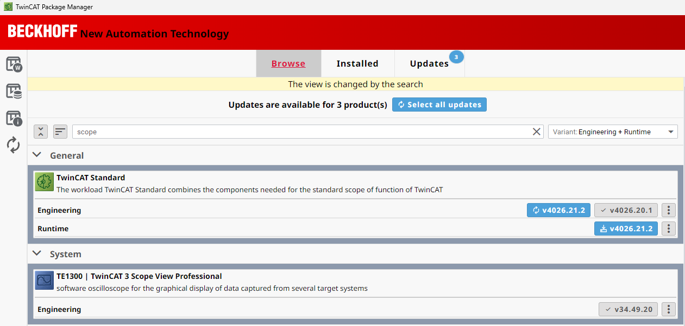

### Create Scope Project

First, add a new project under the same solution 'Refrigerator' that you created in the class about Visualization.

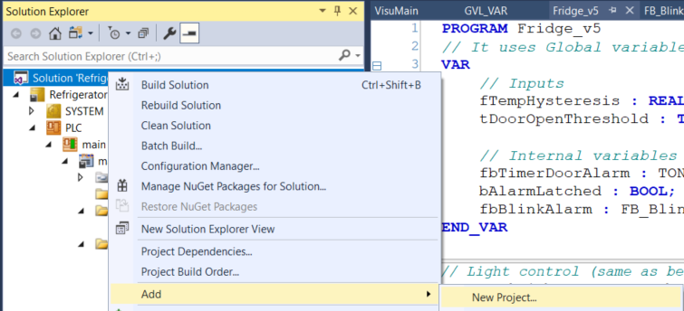

Choose the option "YT Scope Project" and save with the name "Measurement1".

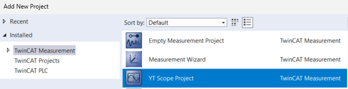

You will see a new entry in the Solution Explorer.

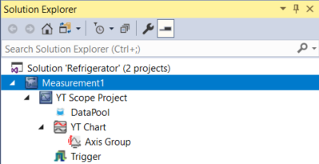

In DataPool, right click with the mouse to choose Target Browser. You will choose the variable you want to record and make available to plot.

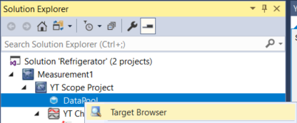

Then, open the GVL_VAR and choose `bAlarmOut`, `bCompressor`, `bDoorOpen`, and `fTempActual`. You can double click or right click to select "Add to Scope".

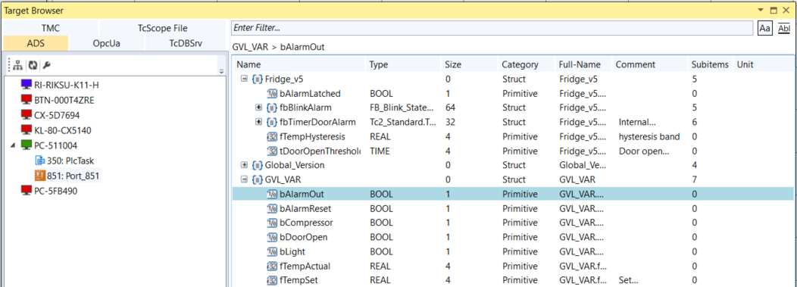

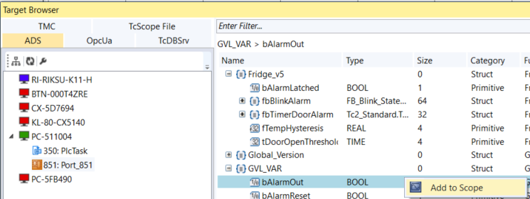

The 4 variable should be under DataPool. Let's start plotting 2. Select `fTempActual` and `bCompressor` and drag then to Axis Group. The result should be like in the image. 

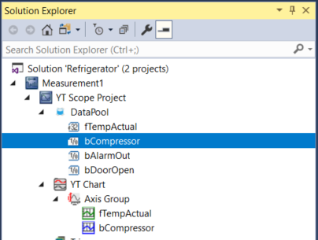

Now, let's start recording the variables. First, add the toolbar "TwinCAT 3 Scope" from View/Toolbars.

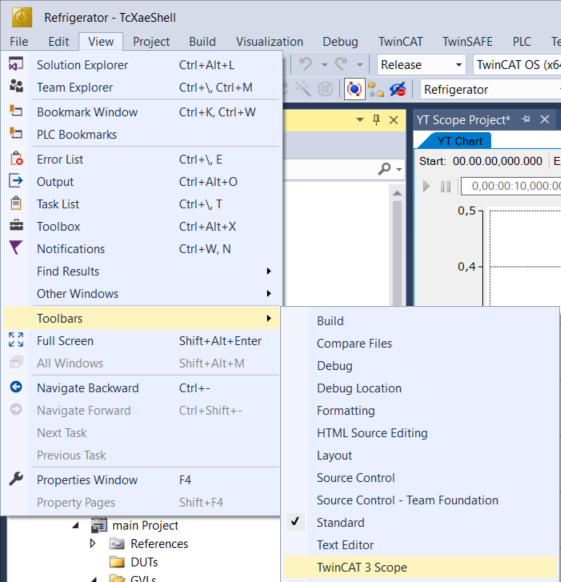

The new toolbar should appear in the menu. It has 4 buttons. Click on "Start Record".


You will see data being acquired and plotted. Keep it running for some seconds to see the temperature increasing and decreasing.

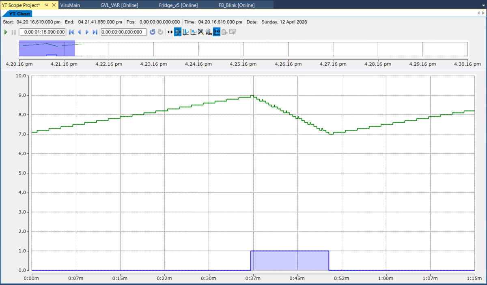

After some time, you can stop the recording (icon with a blue square, close to where you started the recording).

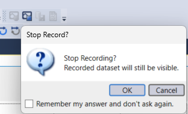

You can save the data for further analysis.

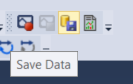

Let's add time markers to measure the time the compressor was on. Select "New Time Marker". Add two.

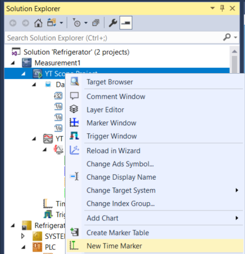

Then, visualize the marker window.

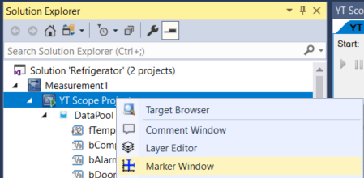

On the marker window, select New Autofill Table with the Axis Group.

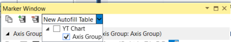

You can move the time markers to the instants when the compressor turned on and off. 

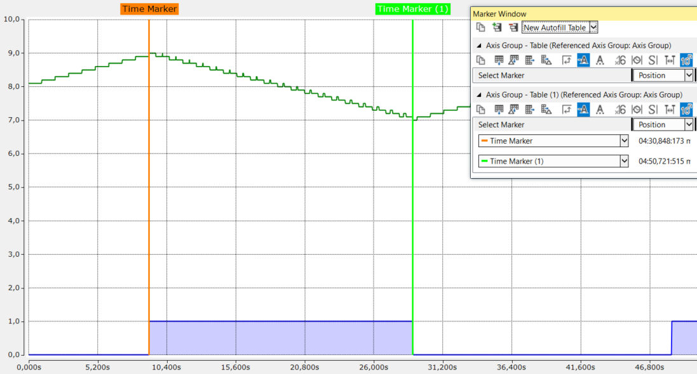

Then, add a new row with delta values, that is, the difference between two markers.

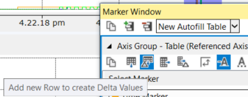

Choose the markers and note the values for time difference (around 20 s) and temperature difference (-2).

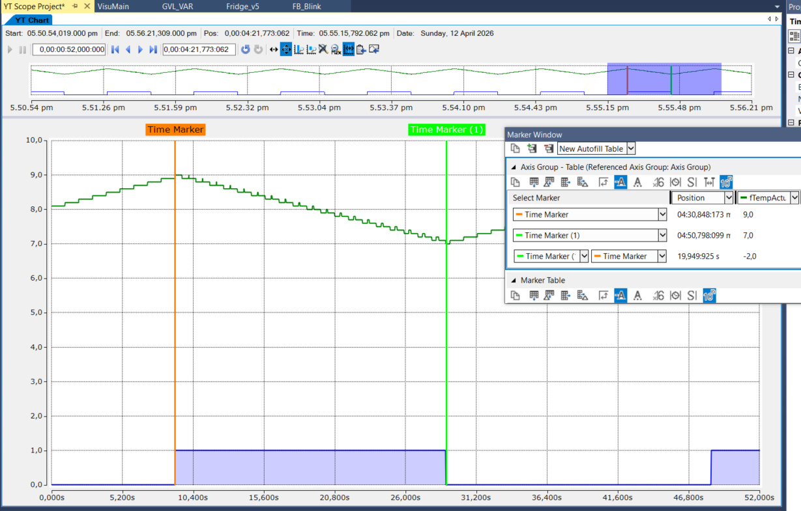

## Blinking alarm

Currently, when the door is kept open for more than 10 s, a latch alarm (LED) turns on. But, how to change it to blink?

In PLC code, you do not use delays like in Arduino because they would block processing. We saw in previous classes the use of timers, and the solution for blinking takes advantage of timers. 

To make blinking action available in other places of the code, we will create a function block. In your PLC project, add a POU of the type "Fucntion Block" with the name FB_Blink.

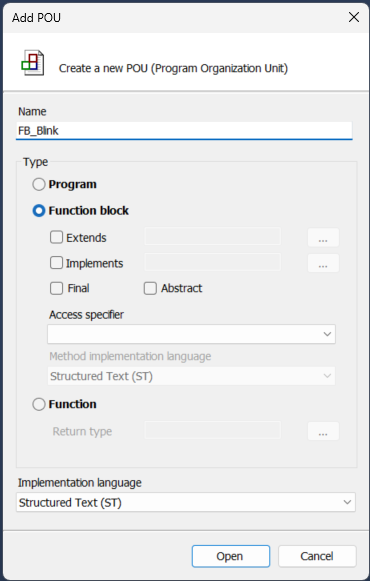

In the code editor, write the following:

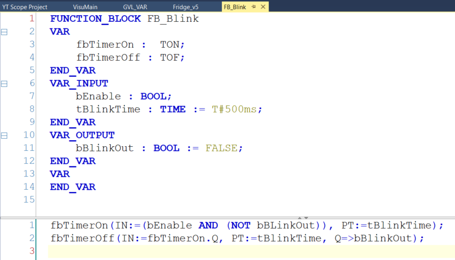

The section `VAR` refers to internal variables of the function block. In `VAR_INPUT`, you find the parameters (inputs) for the function block. `VAR_OUTPUT` is the equivalent of a function return.

The code has only two lines:

- `fbTimerOn` (`TON`) creates a one-scan pulse
- `fbTimerOff` (`TOF`) stretches that pulse into the visible lamp ON time

### What each line does

```pascal
fbTimerOn(IN:=(bEnable AND (NOT bBLinkOut)), PT:=tBlinkTime);
fbTimerOff(IN:=fbTimerOn.Q, PT:=tBlinkTime, Q=>bBlinkOut);
```

#### First timer: `TON`
```pascal
fbTimerOn(IN := bEnable AND NOT bBlinkOut, PT := tBlinkTime)
```

This means:

- while blinking is enabled
- and while output is currently **OFF**
- start an **on-delay** timer

After `tBlinkTime`, `fbTimerOn.Q` becomes `TRUE`.

#### Second timer: `TOF`
```pascal
fbTimerOff(IN := fbTimerOn.Q, PT := tBlinkTime, Q => bBlinkOut)
```

This means:

- when `fbTimerOn.Q` goes `TRUE`, `bBlinkOut` goes `TRUE` immediately
- when `fbTimerOn.Q` goes back `FALSE`, the `TOF` keeps `bBlinkOut` `TRUE` for `tBlinkTime`

That is the trick.

### Step-by-step behavior

Assume:

- `bEnable = TRUE`
- `tBlinkTime = 500 ms`

Initial state:

- `bBlinkOut = FALSE`

#### Phase 1: output OFF
Because `bBlinkOut = FALSE`, the `TON` input is:

```pascal
bEnable AND NOT bBlinkOut = TRUE AND TRUE = TRUE
```

So `fbTimerOn` starts timing.

For 500 ms:

- `fbTimerOn.Q = FALSE`
- `bBlinkOut = FALSE`

#### Phase 2: `TON` finishes
After 500 ms:

- `fbTimerOn.Q` becomes `TRUE`

That `TRUE` is fed into the `TOF`, so:

- `bBlinkOut` becomes `TRUE` immediately

#### Phase 3: `bBlinkOut` feeds back and kills the `TON`
Now that `bBlinkOut = TRUE`, the `TON` input becomes:

```pascal
bEnable AND NOT bBlinkOut = TRUE AND FALSE = FALSE
```

So on the **next PLC scan**, `fbTimerOn` resets and its `Q` goes back `FALSE`.

It means that `fbTimerOn.Q` is only a **short pulse**.

#### Phase 4: `TOF` holds the output ON
Even though `fbTimerOn.Q` has gone back `FALSE`, the `TOF` keeps `bBlinkOut = TRUE` for another 500 ms.

After that delay expires:

- `bBlinkOut` becomes `FALSE`

And now we are back to Phase 1. A timing diagram for this process is shown below.

<!--
Timing diagram done with https://wavedrom.com
{ "signal" : [
  { "name": "bEnable", "wave": "01..................." },
  { "name": "IN1", "wave": "01.....0.....1.....0.", },
  { "name": "Q1=IN2", "wave": "0......10..........10" },
  { "name": "Q2=BlinkOut", "wave": "0......1.....0.....1." },   
]}
-->
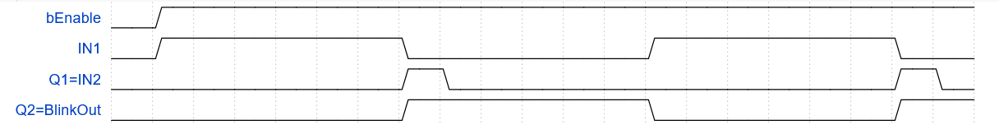

### Result

The output `bBlinkOut` is approximately:

- OFF for 500 ms
- ON for 500 ms
- OFF for 500 ms
- ON for 500 ms
- ...

So the blink period is about:

$$
T \approx 2 \cdot tBlinkTime
$$

and the frequency is about:

$$
f \approx \frac{1}{2 \cdot tBlinkTime}
$$

For `tBlinkTime = 500 ms`:

$$
T \approx 1.0\ s,\qquad f \approx 1\ \text{Hz}
$$

### Simpler equivalent idea

A more readable mental model is:

- while OFF, wait 500 ms
- then turn ON
- while ON, wait 500 ms
- then turn OFF

This code achieves that indirectly with a `TON` feeding a `TOF`.

### Calling the function block

In the main program (that you can name Fridge_v5), the only change to the previous version is in the line of the output alarm.

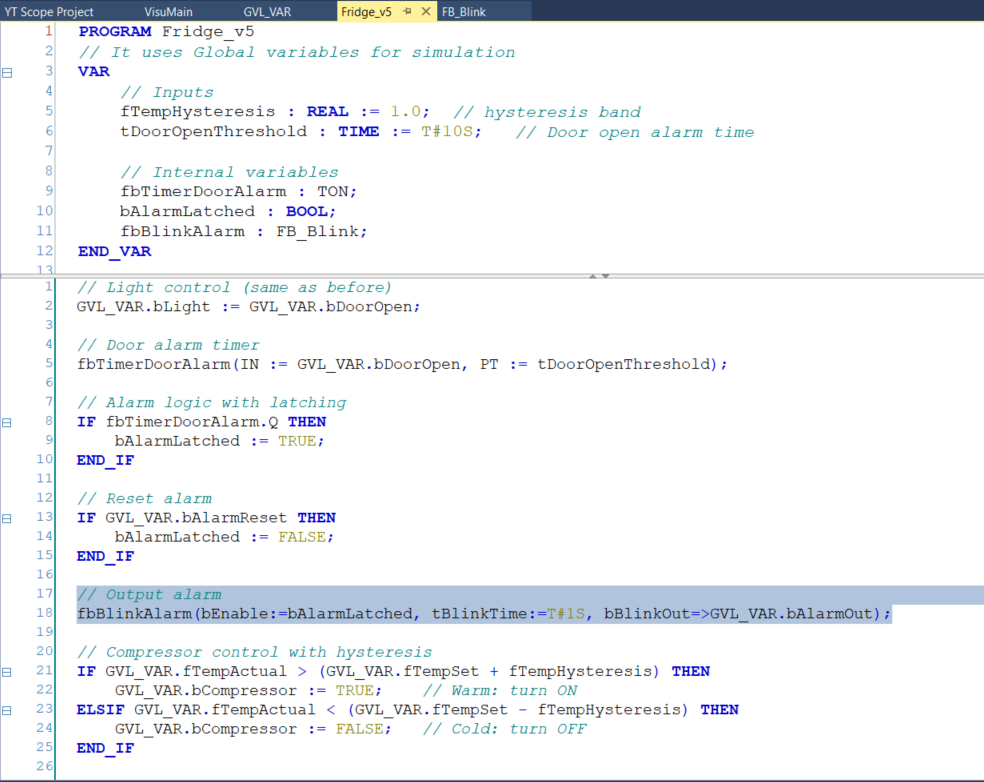

### Visualizing alarm timing

You can now include the `bDooropen` and `bAlarmOut` to the Axis Group in the TwinCAT Scope.

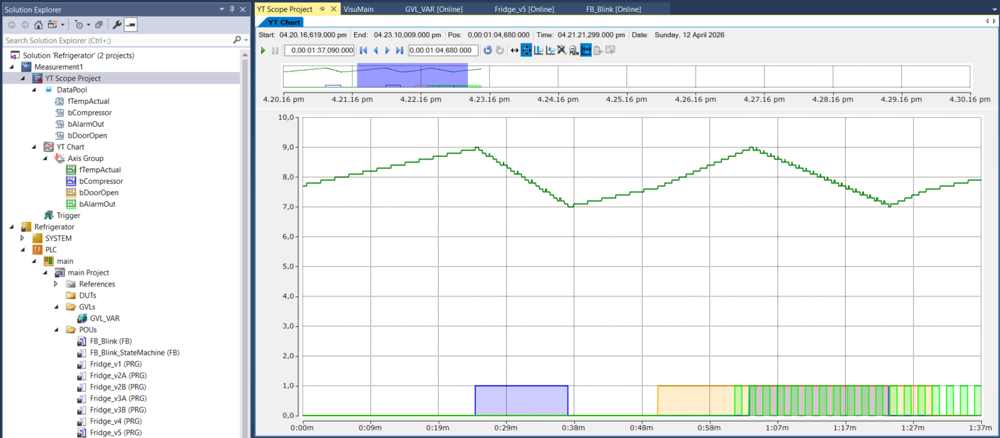

Then, use the markers and a delta row to measure the time

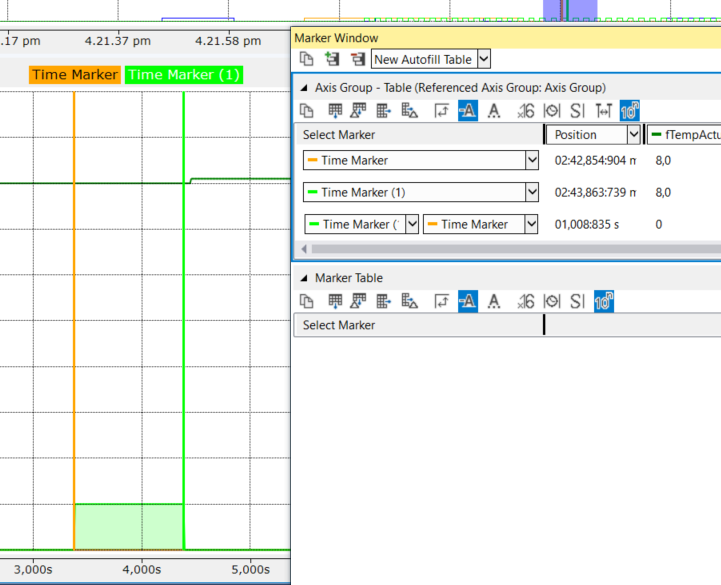

---

## Activity

Incorporate the physical I/Os to your project:
- switch for simulating door opening
- LED for door open
- blinking LED (alarm) when door is open for long time
- momentary switch for resetting alarm
- LED for compressor
- temperature sensor
Include the VISU, but change the control to keep only the temperature setting. The door and the reset are done with the physical switches.

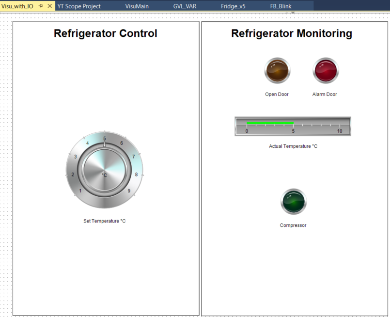
