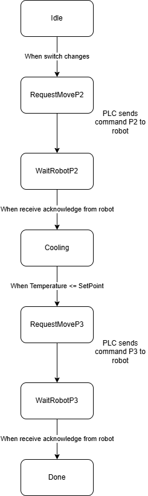
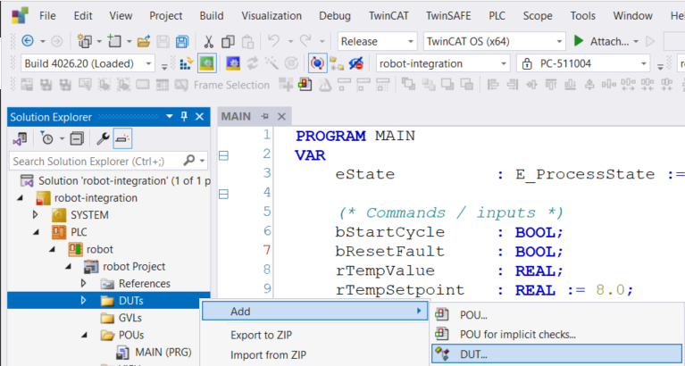

# Integration with robotic arm

## Agenda

1. Application in industry
2. The tasl
3. Wiring
4. Programming the robot
5. Programming the PLC
6. Testing


## Motivation

In modern manufacturing, controlling temperature is a critical step that determines product quality, safety, and performance. In many industries, parts or products leave a process in a hot or unstable state and must be cooled in a controlled way before they can be handled, inspected, or packaged.

For example, in metalworking, components are frequently heated and then rapidly cooled in a process called [quenching](https://en.wikipedia.org/wiki/Quenching) (you can check the video https://www.youtube.com/watch?v=V8r6T7X4ApI from 0 to 1:10). This controlled cooling changes the internal structure of the material, improving its strength and durability. If the cooling conditions are not correct, the final product may not meet specifications.

A similar challenge appears in the food industry. After cooking or forming, products often need to be cooled quickly to preserve quality and ensure food safety. Maintaining the correct temperature during this step is essential to meet hygiene standards and avoid spoilage.

In both cases, automation is very important. A programmable logic controller (PLC) monitors process conditions such as temperature and coordinates the sequence of operations. A robotic arm handles the physical movement of parts, transferring them between stations in a safe way.

In this activity, you will emulate a simplified version of this process. A robotic arm will pick up a part, transfer it to a cooling station, and then move it to a final location. The PLC will supervise the operation: checking that the correct temperature was reached, controlling the sequence, and providing visual feedback through indicators (LEDs).

Although the setup is simplified, the principles you will implement are the same ones used in real industrial systems: sequencing, sensor-based decision making, and coordination between control systems and robotic devices.

> Note: In a real factory, moving parts would be glowing at 900°C. Because we can't do that here, we use the ice bath to represent the quench tank.

## The task

From the robot perspective, the task is simply moving a part from point 1 (hot area) to point 2 (cooling tank) to point 3 (finished product). Remember that you always need to use linear movements when arriving to or departing from the pick and place positions (the approach position is exactly over the pick and place). You already know that and you practiced it many times in previous courses.


However, there is one new condition here. The part should stay in the cooling tank for as long time as needed for the temperature to drop and reach a certain value. It means you cannot simply use a `wait time` command. The temperature should be monitored. This is one of the tasks executed by the PLC.

In fact, the PLC will control the whole process. It will inform the robot **when to start** (pick from 1 and place in 2) and **when to continue** (move from 2 to 3).

We are going to use only 2 wires (plus GND). In this solution:

- the robot already has a program
- the PLC sends a handshake signal to advance the process
- the robot sends an acknowledge signal back

The flow of information is as follows:
- `EL2008 DO4 -> MG400 DI8` = **PLC command / continue**
- `MG400 DO8 -> EL1008 DI8` = **Robot acknowledge / state reached**

A very practical handshake is this:

1. PLC sets command `TRUE`  
   → robot picks at **Position 1** and moves to **Position 2**
2. Robot sets acknowledge `TRUE` when it reaches **Position 2**
3. PLC waits until temperature is low enough
4. PLC sets command `FALSE`  
   → robot moves from **Position 2** to **Position 3**
5. Robot sets acknowledge `FALSE` when it reaches **Position 3**

That way, a single bit in each direction is enough.

## Wiring

In the Beckhoff PLC module, keep all the wiring from the previous class and include three connections:
- `EL1008` input 8 connected to `MG400` digital output 8
- `EL2008` output 4 connected to `MG400` digital input 8
- `GND` in the PLC module connected to `GND` in the `MG400`


In the `MG400`, keep the wiring for the vacuum gripper and add the three connections.


### First tests

Using the `IO` panel in DobotStudio, change the DO 8 to `on` and check in the PLC (`EL1008` LED 8 should turn on).

Do the other direction. In TwinCAT XAE, use `Online Write 1` for the Output 4 in `EL2008`. Check in DobotStudio if DI 8 changed to green (on).

If these tests don't work, ask help from the teacher.

## Program for the robot

The MG400 side will do the following:

1. Wait for `DI8 = TRUE`
2. Pick part at `Position 1` (remember to use approach and MovL)
3. Move to `Position 2`
4. Set `DO8 = TRUE`
5. Wait for `DI8 = FALSE`
6. Move to `Position 3`
7. Set `DO8 = FALSE`

Write the program for that. You can choose between Blockly, RoboDK or Lua directly.

## Program for the PLC

Although the logic is not complex, if you start using a series of `IFs`, it will become impossible to understand and debug. For this reason, we will use a **state machine**.

A state machine is a programming structure used to describe systems that operate in a sequence of clearly defined steps. Instead of writing one large program that tries to control everything at once, the process is divided into states such as *Idle*, *Move to Cooling Tank*, *Cooling*, *Move to Ready Position*, and *Complete*. At any moment, the system is in only one state, and the logic executed depends on that current state. This makes the program easier to understand, test, and troubleshoot.

State machines are especially useful in industrial automation because many machines and processes follow a step-by-step sequence. In this activity, the PLC controls the overall process while the robotic arm performs the physical movement. The PLC can wait for a signal from the robot, check the temperature sensor, activate outputs, or detect an error before moving to the next state. For example, the system should not command the robot to move the part to the final position until the cooling temperature condition has been satisfied.

Using a state machine also improves safety and reliability. Each state can define exactly which outputs should be active and what conditions are required to continue. If the robot does not respond within a certain time, or if the temperature is outside the expected range, the PLC can move to a fault state instead of continuing the process. This approach is common in real industrial systems because it creates predictable behavior and makes it easier to add alarms, interlocks, and manual reset procedures.

In a graphical representation, we have the following:



### What each state does

#### `Idle`
- robot command is low
- system waits for `StartCycle`

#### `RequestMoveToP2`
- PLC sets `RobotCmd := TRUE`
- robot interprets that as: pick at position 1, move to position 2

#### `WaitRobotAtP2`
- PLC waits until `RobotAck = TRUE`
- this means robot reached cooling tank

#### `Cooling`
- robot stays at position 2
- PLC checks `TempValue <= TempSetpoint`

#### `RequestMoveToP3`
- PLC sets `RobotCmd := FALSE`
- robot interprets that as: move to position 3

#### `WaitRobotAtP3`
- PLC waits until `RobotAck = FALSE`
- this means robot reached ready/output position

#### `Done`
- cycle complete

#### `Fault`
- for timeout or other error

### State machine in Structured Text

It is common practice to use enumerations for a state machine. In ST, a new data type should be created as a DUT (data unit type).



Then, add the `E_ProcessState` enumeration.

```iecst
{attribute 'qualified_only'}
{attribute 'strict'}
{attribute 'to_string'}
TYPE E_ProcessState :
(
    stIdle,
    stRequestMoveToP2,
    stWaitRobotAtP2,
    stCooling,
    stRequestMoveToP3,
    stWaitRobotAtP3,
    stDone,
    stFault
);
END_TYPE
```

The program, as you know, should be a POU. I'll provide below a working code that you can test and simulate using `Write Values`. Once you test and understand what is happening, you need to move the variables related to I/O to a GVL, indicate them as input (`AT %I*`) or output (`AT %Q*`) and do the correct mapping to the physical I/Os as you did in previous classes.

```
PROGRAM MAIN
VAR
    eState          : E_ProcessState := E_ProcessState.stIdle;

    (* Commands / inputs *)
    bStartCycle     : BOOL; (* from a switch *)
    bResetFault     : BOOL; (* from momentary switch *)
    rTempValue      : REAL; (* read from the sensor LM35 *)
    rTempSetpoint   : REAL := 8.0;

    (* I/O *)
    bRobotAck       : BOOL;     (* EL1008 input 8  <- MG400 DO8 *)
    bRobotCmd       : BOOL;     (* EL2008 output 4 -> MG400 DI8 *)

    (* Status *)
    bCycleDone      : BOOL;
    bFaultActive    : BOOL;

    (* Timer *)
    tonStepTimeout  : TON;
END_VAR
CASE eState OF
    E_ProcessState.stIdle:
        bRobotCmd := FALSE;
        bCycleDone := FALSE;
        bFaultActive := FALSE;
        tonStepTimeout(IN := FALSE);

        IF bStartCycle THEN
            eState := E_ProcessState.stRequestMoveToP2;
        END_IF;

    E_ProcessState.stRequestMoveToP2:
        bRobotCmd := TRUE;
        tonStepTimeout(IN := FALSE);
        eState := E_ProcessState.stWaitRobotAtP2;

    E_ProcessState.stWaitRobotAtP2:
        bRobotCmd := TRUE;
        tonStepTimeout(IN := TRUE, PT := T#30S);

        IF bRobotAck THEN
            tonStepTimeout(IN := FALSE);
            eState := E_ProcessState.stCooling;
        ELSIF tonStepTimeout.Q THEN
            eState := E_ProcessState.stFault;
        END_IF;

    E_ProcessState.stCooling:
        bRobotCmd := TRUE;
        tonStepTimeout(IN := FALSE);

        IF rTempValue <= rTempSetpoint THEN
            eState := E_ProcessState.stRequestMoveToP3;
        END_IF;

    E_ProcessState.stRequestMoveToP3:
        bRobotCmd := FALSE;
        tonStepTimeout(IN := FALSE);
        eState := E_ProcessState.stWaitRobotAtP3;

    E_ProcessState.stWaitRobotAtP3:
        bRobotCmd := FALSE;
        tonStepTimeout(IN := TRUE, PT := T#30S);

        IF NOT bRobotAck THEN
            tonStepTimeout(IN := FALSE);
            eState := E_ProcessState.stDone;
        ELSIF tonStepTimeout.Q THEN
            eState := E_ProcessState.stFault;
        END_IF;

    E_ProcessState.stDone:
        bRobotCmd := FALSE;
        bCycleDone := TRUE;
        bFaultActive := FALSE;
        tonStepTimeout(IN := FALSE);

        IF NOT bStartCycle THEN
            eState := E_ProcessState.stIdle;
        END_IF;

    E_ProcessState.stFault:
        bRobotCmd := FALSE;
        bCycleDone := FALSE;
        bFaultActive := TRUE;
        tonStepTimeout(IN := FALSE);

        IF bResetFault THEN
            eState := E_ProcessState.stIdle;
        END_IF;
END_CASE;
```

### Extra: LEDs

You can make the state machine more visible to improve debugging.

- **Green LED**: `State = stIdle`
- **Blue LED**: `State = stCooling`
- **Yellow LED**: `State = stWaitRobotAtP2 OR stWaitRobotAtP3`
- **Red LED**: `State = stFault`
