# How to Install TwinCAT 3.1 Build 4026

We will install the most recent version, build **4026**.

## Registration

First, register at https://www.beckhoff.com/en-en/mybeckhoff-registration/index.aspx. It is needed for downloading the software.

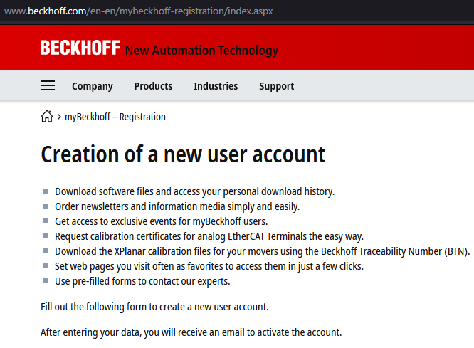

## Download Package manager
Then, download the TwinCAT Package Manager from https://www.beckhoff.com/en-en/products/automation/twincat/twincat-3-build-4026/

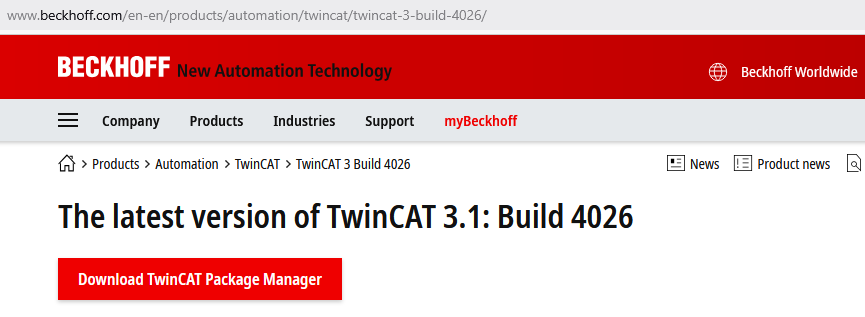

Install it and run. Setup the *Feeds* in Settings.

## Add Stable Feed
Add a stable feed. You need to be registered in Beckhoff to set the credentials.

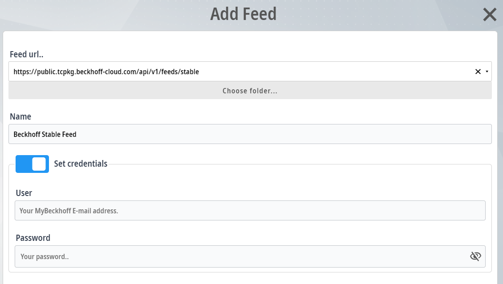

Include the integration for **both** 32- (we will need this because our IPCs/PLCs use this version) and 64-bit versions.

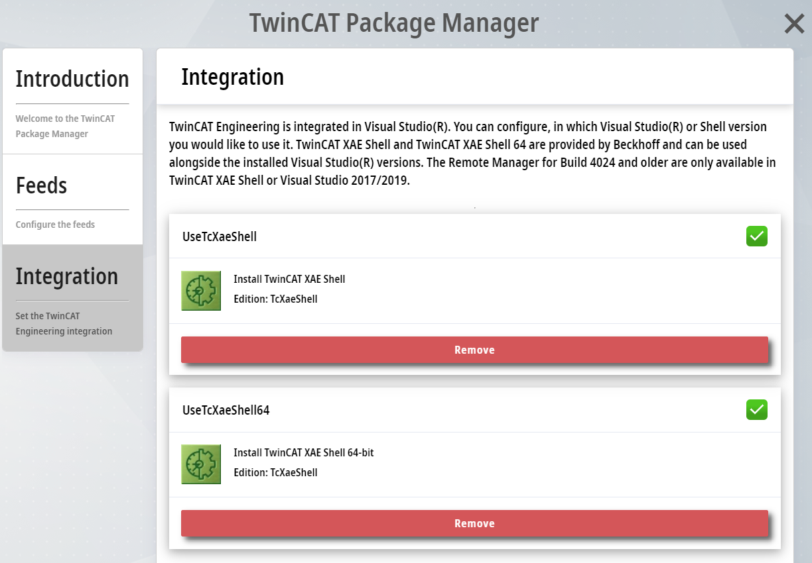

## Setup workloads

Go to the workload tab.

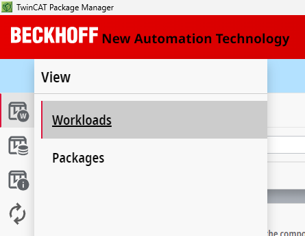

## Install 4026
Install **3 items**: TwinCAT Engineering, Runtime and Remote Manager.

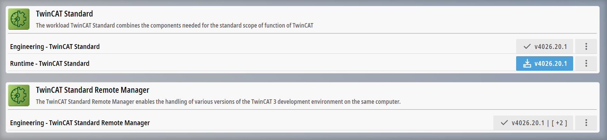

After this, you can open the TwinCAT XAE Shell.

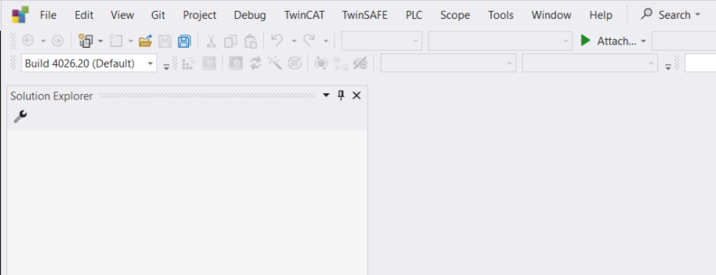

## Additional steps
Our IPCs/PLCs use the Runtime Build 4024.35. To compile code for running in the IPC, you need exactly the same version.

In the Package Manager, setup another feed, using the **outdated** url.

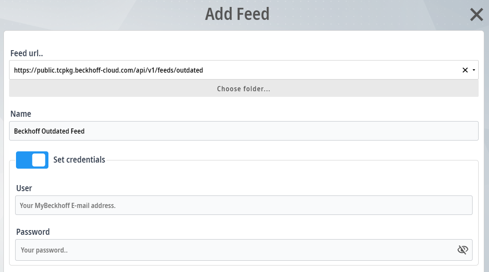

Then, in the Remote Manager, select Other versions.

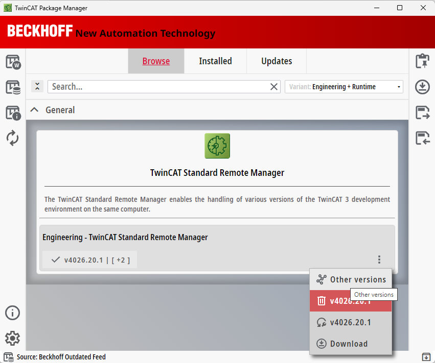

In the side panel, select Versions. A long list will be available.

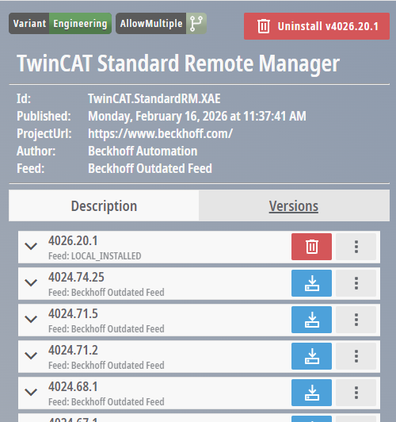

Install the 4024.35.30.

## Hyper-V

If you tried to run code locally

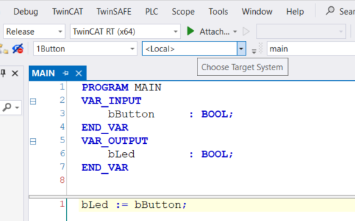

maybe you received a message about Hyper-V and VBS (as I have in my work computer).

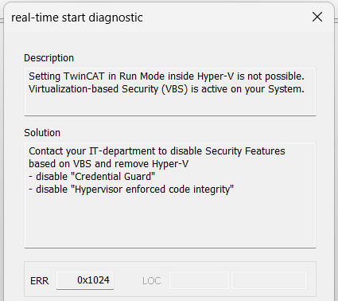

If you are not allowed to disable the *security features* (as me), then one option is to run a virtual machine with the BSD **runtime**. You can keep your XAE (the IDE, Engineering) in your host machine, what makes it faster, and have only the runtime in a virtual machine.

### Solution using VirtualBox

Very detailed video in [TwinCAT BSD in VirtualBox](https://www.youtube.com/watch?v=vGtE8-R_mFQ), by Coding Bytes, 17.7.2024 

If you want a summary:
- install VirtualBox https://www.virtualbox.org/wiki/Downloads
- download the [TwinCAT BSD runtime](https://www.beckhoff.com/en-en/products/ipc/software-and-tools/operating-systems/c9900-s6xx-cxxxxx-0185.html) from Beckhoff. Mine was version 14.3.7.0, build 275264, 03.02.2026.
- create a ready-to-use VirtualBox machine with: https://github.com/PTKu/TwinCAT-BSD-VM-creator

### Solution using VMware Workstation Pro

First you need to register in Broadcom. Then [download](https://support.broadcom.com/group/ecx/productdownloads?subfamily=VMware%20Workstation%20Pro&freeDownloads=true) and install VMware. Check the video
[(Update) Install VMware Workstation Pro for Windows FREE!](https://www.youtube.com/watch?v=K9bnuF_lq5I) | VMware Workstation Pro 25H2, by GEEKrar, 19.12.2025

Then, install the BSD runtime. Check the video [TwinCAT/BSD in a virtual machine](https://www.youtube.com/watch?v=H-qfWfz37Fg), by 
Jakob Sagatowski, 13.12.2021

